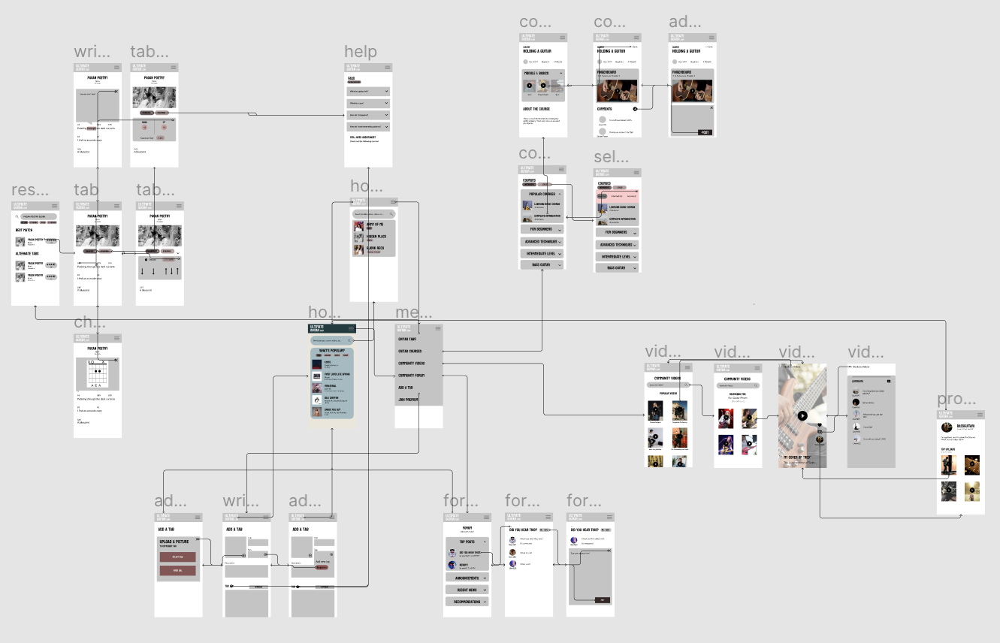
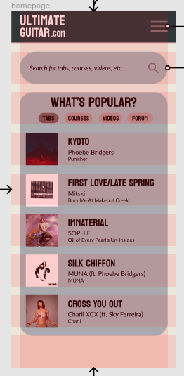
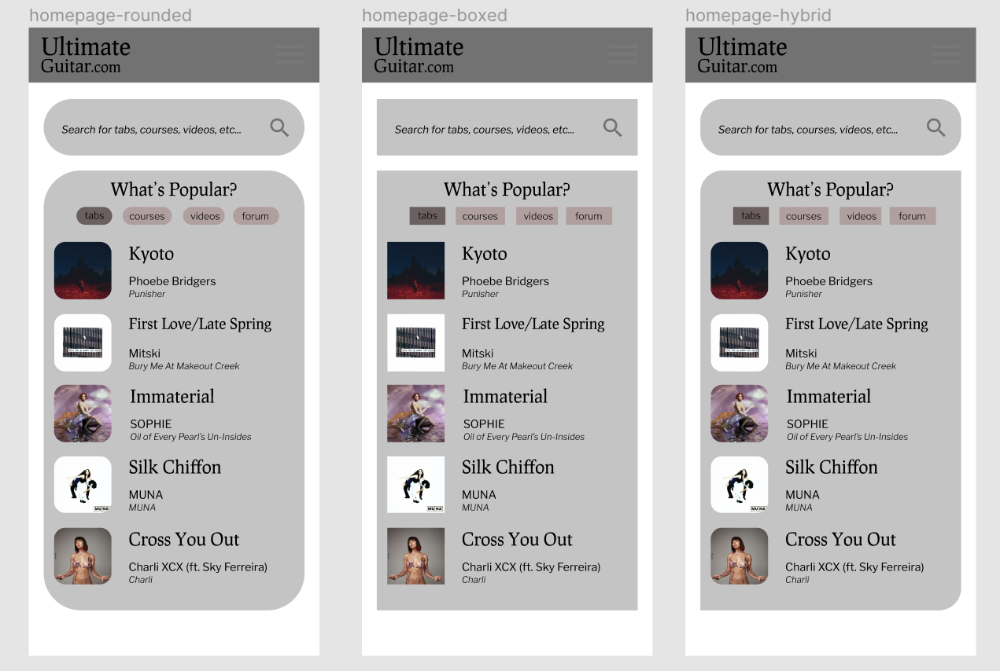
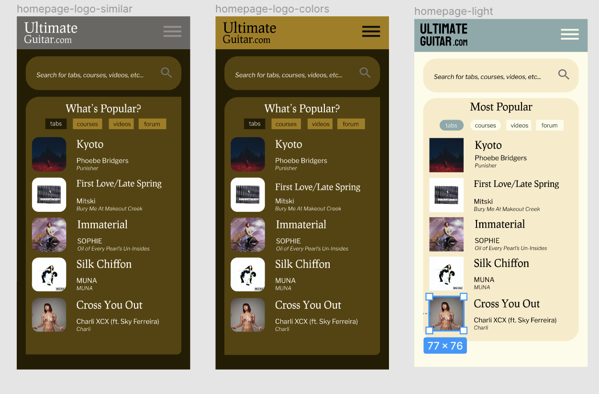
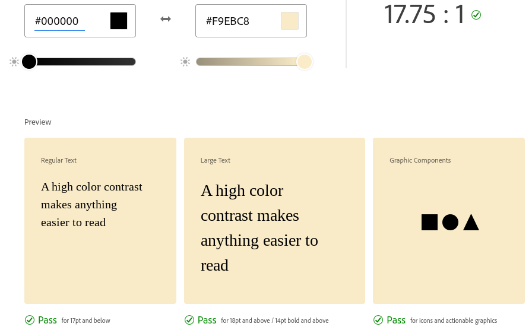

# Assignment 06: Interface Design

James Yoon

Digital Humanities 110: User Experience and Design (S'22)

# Summary

This UX project aims to make Ultimate-Guitar easier to use and relevant for both beginner and advanced users. I want to provide enough context to the app so that beginner users can get a sense of how guitar and music theory works, while still allowing for flexibility so that advanced users can focus on the tasks that apply to them. Last week, I created a low-fidelity prototype on paper so that I could focus the content of each wireframe and the overall layout. This week, I focused on interface design and *how* the buttons and modules I created last week will look on a phone/mobile screen.

This assignment consisted of four steps:

- Digitizing my wireflow from last week on Figma.
- Deciding on a layout using Figma's grid system.
- Testing different fonts, shapes, and colors.
- Doing an impression test with another person for feedback.
- Checking color accessibility through color contrast.

# Digitized Wireflow

[My digitized wireflow can be found here under "Wireflow".](https://www.figma.com/file/yUsEoH8TuOMggfTpZ1Buwf/Ultimate-Guitar-A06?node-id=107%3A96)

Given the size of the wireflow, all subsequent interface tests were done with the home page (labeled "homepage") on Figma.

# Interface Tests

## Layout

During the digitization process, I focused on the layout of the screens. Using the homepage as the case study, I created a grid pattern consisting of 9 rows and 1 column. 9 rows seemed appropriate, since it allowed enough room and spacing for modules or links to guitar tabs without overloading the user with too much information. Given that I created this prototype on a mobile frame, I chose 1 column to minimize clutter.

The grid parameters are below:

- **ROWS**: 9 rows, 0 margin, 20 gutter
- **COLUMNS**: 1 column, 20 margin

My reasoning behind choosing 20 pts as my margin was for consistency with the gutter as well as being approximately ~40% of the text size of the headings (32pt). This margin size is close to the recommended size (half the size of the text size), and giving just slightly more margin room than expected might make the app seem cluttered.

## Typography

For the rest of the interface tests, I created duplicates of the homepage. [All of these wireframes can be found on Figma here.](https://www.figma.com/file/yUsEoH8TuOMggfTpZ1Buwf/Ultimate-Guitar-A06?node-id=104%3A96)

The first row of four screens consisted of homepage-prociono-libre-franklin; homepage-koulen-libre-franklin; homepage-crimson-pro-inter; and homepage-oswald-prociono. Each screen was named according to *homepage-headingtextfont-subheading/bodytextfont*. As thus, the fonts are summarized below.

| Screen      | Heading Font | Subheading/Body Font | 
| ----------- | ----------- | -----------------|
| homepage-prociono-libre-franklin      | Prociono (Serif)      | Libre Franklin (Sans-Serif) |
| homepage-koulen-libre-franklin   | Koulen (Display, Sans-Serif)        | Libre Franklin (Sans-Serif) |
| homepage-crimson-pro-inter   | Crimson Pro (Serif)        | Inter (Sans-Serif) |
| homepage-oswald-prociono   | Oswald (Display, Sans-Serif)        | Prociono (Serif) |

For the body fonts, Libre Franklin and Inter are very similar sans-serif fonts, while Prociono is a serif font that may convey more of a formal, academic feel. For the headings, all four screens have heading fonts that are quite different from the body fonts, which will help with distinguishing which is which. As with the body font, Prociono and Crimson Pro might convey more of an academic tone, while Koulen and Oswald are more informal. 

Koulen is all upper-case, which may impact readability. However, since it would only be used for headers, it wouldn't be as inaccessible as if it were used for body text.

All four screens had the same text size: 32 (bold) for large headers, 24 (bold) for song titles, 15 for artist names, and 12 (italic) for album titles. These sizes were decided during the layout stage, since they fit well into the 9 row/1 column grid. The rationale for the slightly different sizes between the artist names and album covers was to help the user distinguish between the two. Album titles were italicized based on standard style formats.

## Shape Variations

This test mainly revolved around adjusting the rounded/boxy shapes in the layout. Three test screens were created in the second row: *homepage-rounded, homepage-boxed, and homepage-hybrid*. The parameters for each screen are below:

| Screen      | Roundedness Parameter | Rationale | 
| ----------- | ----------- | -----------------|
| homepage-rounded      | 50      | Seems more approachable, "friendly" |
| homepage-boxed   | 1        | More formal, academic |
| homepage-hybrid   | 30 on top left and bottom right, 0 elsewhere        | More unique shape |

## Color Scheme

This test involved creating two color schemes for the homepage: a dark mode (*homepage-logo-colors*) and a light mode (*homepage-light*). An alternative dark mode screen (*homepage-logo-similar*) was created with a gray menubar rather than a yellow one.

A summary of the colors is below:

| Screen      | Menu Bar | Background | Module Shapes | Accent Color/Buttons | Text |
| ----------- | ----------- | -----------------| -----------------| -----------------| -----------------|
| homepage-logo-colors/similar      | A67D03 (dark yellow) for logo-colors, 686763 (grey) for logo-similar | 261D01 (dark brown) | 594302 (yellow-brown) | Same as background and menu bar colors | FBFBFB (white) |
| homepage-light   | 87AAAA (light sea blue) | F2F2F2 (light yellow) | F9EBC8 (slightly darker yellow) | Same as background and menu bar colors | 000000 (black) |

I obtained the colors for dark mode by putting the Ultimate-Guitar logo (black-yellow) into Adobe Color. For light mode, I tried to keep some of the characteristics of the current website (mainly the use of yellow) while adding accents with an another color that was pleasing to the eye (blue-ish). Text colors were kept white or black to ensure the highest contrast with the surrounding dark or light backgrounds.

### Color Accessibility 

Screenshots of Adobe Color's accessibility tool can be found below. Both the light and dark mode screens passed with contrast ratios above 4.5:1.

# Impression Test

An impression test was conducted with the interface designs above. I asked my participant for their insight regarding the typography, shape, and color variations. [A recording of the impression test can be found here (on Soundcloud).](https://soundcloud.com/james-yoon-21/digital-humanities-110-impression-test?utm_source=clipboard&utm_medium=text&utm_campaign=social_sharing)

## Insights

### FOR TYPOGRAPHY
> "Not the biggest fan of \[serif font\] - it doesn't give me the impression that it's a fun app"

> "There is a clear differentiation between the name of the album, the name of the artist, and the song itself."

> "I would've liked to see some sort of separation between the songs (e.g. half-opaque line)"

> Liked the second font (Koulen) much better than the serif fonts (both Crimson Pro and Prociono).

> Liked the fourth font (Oswald) for the name of songs; wanted it to be smaller.

Overall, my participant liked the sans-serif fonts a lot better than the serifs based on the tone that they portrayed. It didn't seem like serif fonts conveyed an engaging tone, which is integral to attracting and maintaining an audience. They also preferred Koulen over Oswald.

### FOR SHAPES
> "I like the rounded edges. They read very Google...It's more user-friendly."

> "I wonder how it would look with completely rounded edges on everything except the song \[album cover\]"

> "\[Screen with boxy corners\] is not very approachable."

> "Doesn't seem like there's a cohesive brand there" (when talking about the hybrid screen).

My participant valued consistency in the shapes, hence why they gravitated toward the all-rounded corners rather than the hybrid shapes. They also valued consistency across different apps (e.g. Google), which is why they liked the rounded, more "approachable" boxes over the boxy ones.

### FOR COLOR SCHEMES
> "I'm not loving the colors...It's the combination of the yellow and black"

> "Album images aren't compatible with \[yellow and black\]"

> "\[The light one\] reads like a notepad."

> Wanted light green/blue instead of yellow.

Overall, they didn't love either the light or dark mode. I can definitely see their point: the dark mode does seem a bit outdated in terms of aesthetics, and the light mode is reminiscent of Apple's notepad. I do want to keep a balance, though, between past Ultimate-Guitar designs and more modern ones - that might be really important in making the new design seem familiar to older users, many of which may have been part of the community for years. I think this particular aspect of the design is the hardest one to perfect, since there's this tension between what was done before (Ultimate-Guitar's established gbrand) and what could be done to modernize it.

# Final Design

Upon receiving feedback from the impression test, I decided on the following:

- **FONTS**: Koulen for headings, Libre Franklin for body/subheadings (although Inter is very similar) - this was in response to my participant's statements about overall tone and branding.
- **SHAPES**: Rounded corners all around - that way, we can keep some consistency within the boxes themselves, as well as between this app and other apps like Google.
- **COLORS**: I think this particular one is still subject to change. I think I'm going to stick with the homepage-logo-colors as the dark mode. I made some changes to the light mode (originally, it had a grey menu bar instead of a blue one) to adopt my interviewee's feedback. 

# Lessons Learned

Overall, doing these interface variations and conducting the impression test was an unique experience. When I was playing around with the designs, none of them felt right - there was always something that felt off about each of those designs, regardless of what font, shapes, or colors I used. I'm not too sure why this is; maybe it's based on my preconceived notions about how design should look based on Google/Facebook/other apps I've used in the past. I also want to keep in mind Ultimate-Guitar's current design: it's crowded and hard to use but has a sort of avant-garde character. Balancing that with other usability considerations made the color scheme incredibly difficult to decide on, and I think it's definitely still up for debate.
